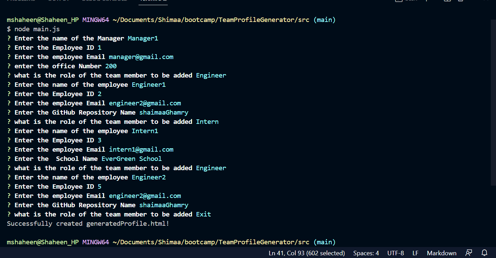
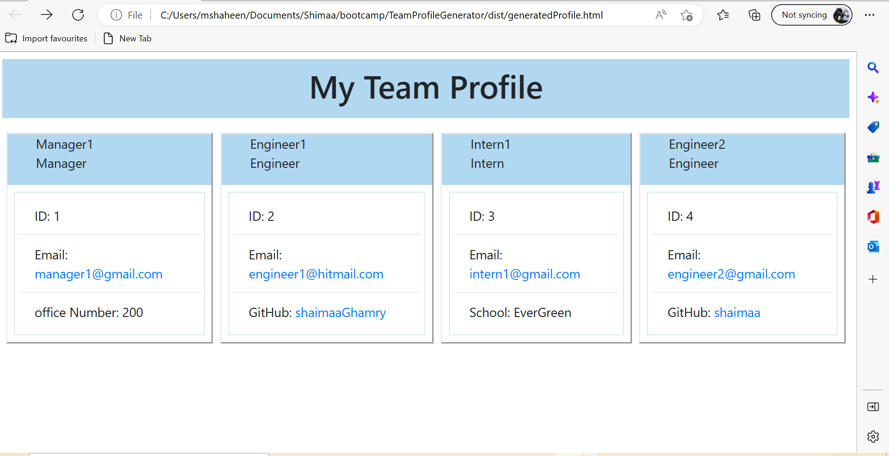

# TeamProfileGenerator
command line application that generate an HTML File as a Team profile using node.js

#
## Description 
This is a command-line application that generates an HTML file that represent the team profile based on the user input, it is a dynamically interactive application using Node.js

# Video URL:
https://drive.google.com/file/d/1390spdzvzYicPkY7R-EF1OSuyf81pbr9/view

#
## Installation

* To generate your own HTML File, `git clone` the repo down to your local so you have the Node project on your local.

* Run `npm install` in order to install the following npm package dependencies as specified in the `package.json`:

* In the command line, start running the application using node main.js

* Answer the question prompts in the command line to generate the HTML File

* After providing all the required inputs an HTML file will be generated in a directory called "dist"

#
## Usage
* After running the application, the user will be asked to input the name of the team manager, id, email and the office number

* Then the user will be asked to choose if he wants to add an engineer or intern as a team member or to exit

* if the user select to add an Engineer, the the user will be asked to input the engineer name, email, id and the git hub repository name

then, an Engineer  will be added in the team.

* if the user selects to add an Intern, then the user will be asked to enter the Intern name, id, Email anad the school name;

then the Intern employee will be added in the team

*Finally, If the user selects to exit from application, then the generated HTML File will be generated as generatedProfile.html in a folder called dist

